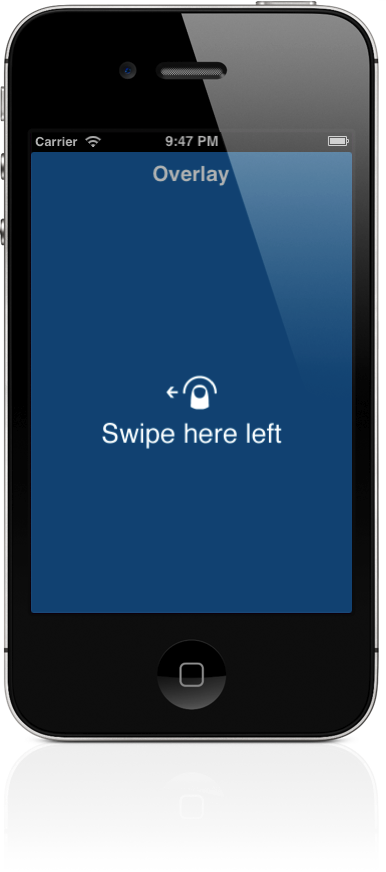

Overlay tutorial
===============
Hi!
This little code is created to help add and manage overlays (image) in your app, especially tutorials.


Import the Overlaytutorial.h file or prefix it, then you can add the overlay with this simple method:
```Objective-C   [TutorialOverlay addOverlayInView:self.view withImageNamed:@"image.png" withAnimation:YES withUserInteraction:YES];```

If userinteraction is YES you must remove the overlay(s) (you can overlay an overlay :) ) with this method:
```Objective-C   [TutorialOverlay removeOverlaysInView:self.view]; ```if not, one simple tap on the overlay will remove that.

You can add a notification, it will fire when the overlay removed:
```Objective-C   [[NSNotificationCenter defaultCenter] addObserver:self selector:@selector(selector:) name:OverlayNotificationKey object:nil];```
